# Tactile Functaset

[![Python Version][python-image]][python-url]
[![Package License][package-license-image]][package-license-url]

This repository contains main code for the paper ["Tactile Functasets: Neural Implicit Representations of Tactile Datasets"](https://arxiv.org/abs/2409.14592) by Sikai Li, Samanta Rodriguez, Yiming Dou, Andrew Owens, Nima Fazeli.

## Overview
🦾 Tactile functaset (TactFunc) reconstructs the high-dimensional raw tactile dataset by training neural implicit functions. It produces compact representations that capture the underlying structure of the tactile sensory inputs. We demonstrate the efficacy of this representation on the downstream task of in-hand object pose estimation, achieving improved performance over image-based methods while simplifying downstream models.

This codebase contains implementations of:

1. Meta-learning for Bubble and Gelslim tactile datasets.
2. Conversion from raw tactile datasets to functasets.
3. Inference over tactile functasets.
4. Downstream models for in-hand object pose estimation.
5. Baselines: ResNet-18, Variational Autoencoder and T3 model.

Bubble and Gelslim datasets are from ["Touch2Touch: Cross-Modal Tactile Generation for Object Manipulation"](https://www.arxiv.org/abs/2409.08269) and can be found [here](https://drive.google.com/drive/folders/15vWo5AWw9xVKE1wHbLhzm40ClPyRBYk5?usp=sharing ).

## Contents
- [Setup](#setup)
- [Data](#data)
- [Experiments](#experiments)
- [Demos](#demos)

### ⛏️ In progress...

## Setup
Git clone the project and cd to the project main directory.

Set up a python virtual environment with the required dependencies using conda.
```
conda create -n <name> python=3.10
conda activate <name>
pip install -r requirements.txt

# To use GPU (NVIDIA, CUDA 12) with jax, install jax with
pip install -U "jax[cuda12]"
```

## Data
### Outline
The structure of the data folder should be as follows:
```
.
├── assets
├── baselines                     # implementations of baselines: VAE, T3 and ResNet-18
├── data
│   ├── datasets                  # folders to setup bubble/gelslim
│   │   ├── bubble
│   │   │   ├── bubble.py
│   │   │   └── checksum.tsv
│   │   └── gelslim
│   │       ├── bubble.py
│   │       └── checksum.tsv
│   ├── functasets                # tactile functasets
│   │   ├── bubble
│   │   ├── combined
│   │   └── gelslim
│   └── meta_learned              # meta learned trunk model checkpoints
│       ├── bubble_pt_dataset
│       ├── combined_pt_dataset
│       └── gelslim_pt_dataset
├── data_utils.py
├── function_reps.py
├── helpers.py
├── pytree_conversions.py
├── README.md
├── requirements.txt
├── tactile_functaset_writer.py
└── tactile_meta_learning.py
```

### Prepare datasets
1. Download Bubble and Gelslim datasets from [here](https://drive.google.com/drive/folders/15vWo5AWw9xVKE1wHbLhzm40ClPyRBYk5?usp=sharing ).
2. Preprocess the datasets. Assume that both datasets are saved under paths:
```
# Bubble Dataset
/data/functa/bubble/          # All bubble data points are under this folder with file name from "data_0.pt" to "data_16127.pt"
# Gelslim Dataset
/data/functa/gelslim/         # All gelslim data points are under this folder with file name from "data_0.pt" to "data_16127.pt"
```

### Setup Bubble dataset as Tensorflow dataset (TFDS)
The bubble tactile sensor data is transformed into a TensorFlow Dataset (tfds) format, enabling seamless integration with JAX/Haiku models while providing access to tfds's diverse data processing capabilities. The input is derived by normalizing the difference between post-contact and pre-contact images from the left-hand-side sensor, which is paired with the corresponding in-hand object pose vector for downstream tasks.

Run:
```
cd data/datasets/bubble
tfds build --register_checksums
```

### Setup Gelslim dataset as Tensorflow dataset (TFDS)
The gelslim tactile sensor data is transformed into a TensorFlow Dataset (tfds) format, enabling seamless integration with JAX/Haiku models while providing access to tfds's diverse data processing capabilities. The input is derived by normalizing and converting the difference between post-contact and pre-contact images from the left-hand-side sensor into grayscale channel, which is paired with the corresponding in-hand object pose vector for downstream tasks.

Run:
```
cd data/datasets/gelslim
tfds build --register_checksums
```

### Use different datasets for meta-learning the trunk network
After setting up Bubble and Gelslim datasets, change the `exp.dataset.name` in `tactile_meta_learning.py`'s `get_config()` to `bubble_pt_dataset`, `gelslim_pt_dataset`, or `combined_pt_dataset` for the dataset you want.

Combined dataset is the combination of bubble and gelslim datasets, and is handled in `data_utils.py`.

## Experiments
### Meta-learning the trunk network
Configure the parameters in `tactile_meta_learning.py`'s `get_config()` and run:
```
python -m tactile_meta_learning --config=tactile_meta_learning.py
```
After training, the checkpoint of the weights of the meta-learned trunk network is saved to both `./tmp/training/{exp.dataset.name}/checkpoint.npz` (will be overwritten) and `./data/meta_learned/{exp.dataset.name}/checkpoint_{exp.model.width}w_{exp.model.depth}d_{exp.model.latent_dim}ld.npz` for better clarification.

### Creating the tactile functasets
Configure the paths for pretrained trunk network weights and created functasets in `tactile_functaset_writer.py`, and run:
```
python -m tactile_functaset_writer --type=DATA_TYPE         # DATA_TYPE should be "bubble", "combined" or "gelslim"
```
After running, the functaset is saved as a `.npz` file to the directory you configured.

### Downstream task - In-hand Pose Estimation
Coming soon!

### Baselines
#### ResNet-18

#### VAE

#### T3

## Demos
*Images compared are of the same size, the displayed differences do not represent the actual size.*
### TactFunc Reconstruction with 3 Gradient Steps (Bubble Sensor)
|  Meta-learned Initialization  |      Reconstruction PSNR = 38.32      |                 Target                 |
| :---------------------------: | :-----------------------------------: | :------------------------------------: |
| 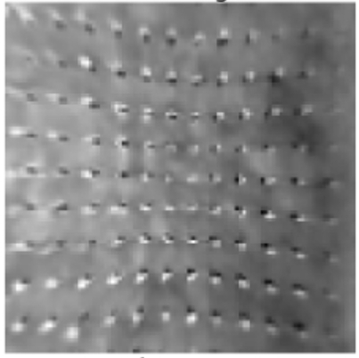 | 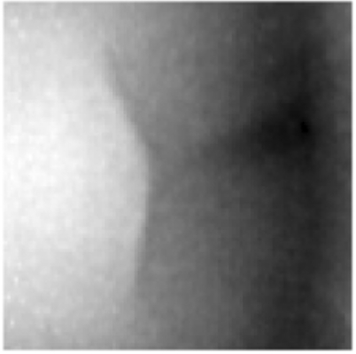 | 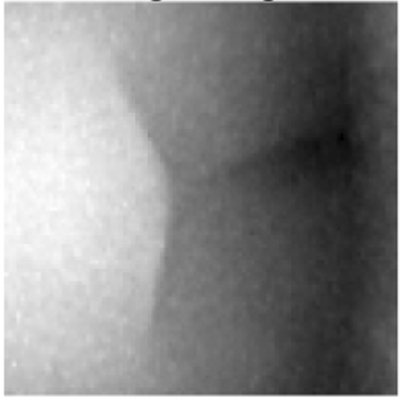 |

### TactFunc Reconstruction with 3 Gradient Steps (Gelslim Sensor)
|  Meta-learned Initialization  |    Reconstruction PSNR = 36.83     |               Target                |
| :---------------------------: | :--------------------------------: | :---------------------------------: |
|  | 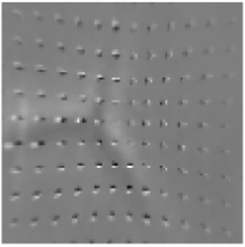 | 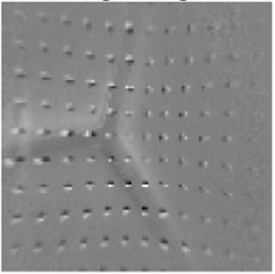 |

### VAE Reconstruction (Bubble Sensor)
|    Reconstruction PSNR = 27.32     |               Target                |
| :--------------------------------: | :---------------------------------: |
| 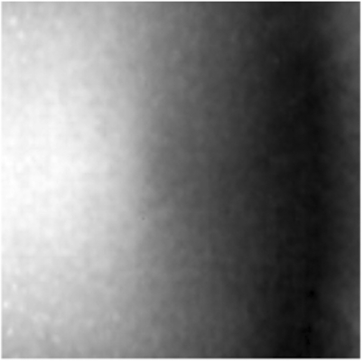 |  |

### VAE Reconstruction (Gelslim Sensor)
|   Reconstruction PSNR = 28.71   |              Target              |
| :-----------------------------: | :------------------------------: |
| 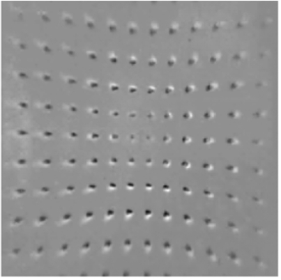 | 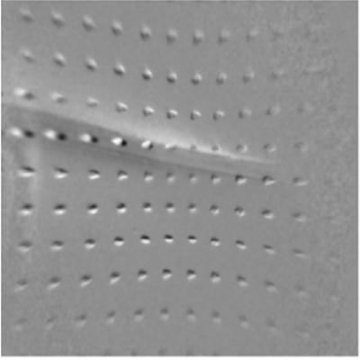 |

### T3 Reconstruction (Bubble Sensor)
|    Reconstruction PSNR = 13.86    |               Target               |
| :-------------------------------: | :--------------------------------: |
| 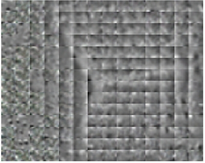 | 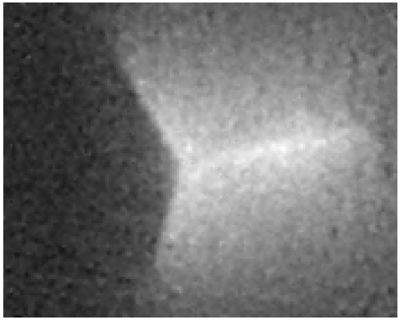 |

### T3 Reconstruction (Gelslim Sensor)
|  Reconstruction PSNR = 24.83   |             Target              |
| :----------------------------: | :-----------------------------: |
| 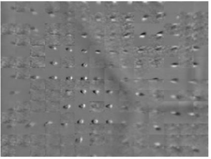 | 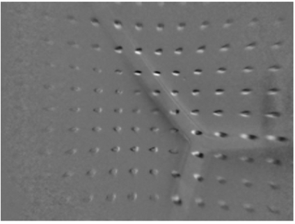 |

## Citation
```
@misc{li2024tactilefunctasetsneuralimplicit,
      title={Tactile Functasets: Neural Implicit Representations of Tactile Datasets}, 
      author={Sikai Li and Samanta Rodriguez and Yiming Dou and Andrew Owens and Nima Fazeli},
      year={2024},
      eprint={2409.14592},
      archivePrefix={arXiv},
      primaryClass={cs.RO},
      url={https://arxiv.org/abs/2409.14592}, 
}
```

## Acknowledgement
This work is supported by NSF GRFP \#2241144, NSF CAREER Awards \#2339071 and \#2337870, and NSF NRI \#2220876.

## License
The source code is licensed under Apache 2.0.

## Contact
For more information please contact skevinci@umich.edu.

[python-image]: https://img.shields.io/badge/Python-3.10%2B-brightgreen.svg
[python-url]: https://docs.python.org/3.10/
[package-license-image]: https://img.shields.io/badge/License-Apache_2.0-blue.svg
[package-license-url]: https://github.com/camel-ai/camel/blob/master/licenses/LICENSE
