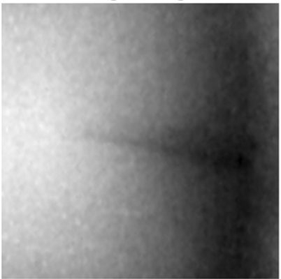

# Tactile Functaset

[![Python Version][python-image]][python-url]
[![Package License][package-license-image]][package-license-url]

This repository contains main code for the paper ["Tactile Functasets: Neural Implicit Representations of Tactile Datasets"](https://arxiv.org/abs/2409.14592) by Sikai Li, Samanta Rodriguez, Yiming Dou, Andrew Owens, Nima Fazeli.

## Overview
🦾 Tactile functaset (TactFunc) reconstructs the high-dimensional raw tactile dataset by training neural implicit functions. It produces compact representations that capture the underlying structure of the tactile sensory inputs. We demonstrate the efficacy of this representation on the downstream task of in-hand object pose estimation, achieving improved performance over image-based methods while simplifying downstream models.

This codebase contains implementations of:

1. Meta-learning for Bubble and Gelslim tactile datasets.
2. Conversion from raw tactile datasets to functasets.
3. Inference over tactile functasets.
4. Downstream models for in-hand object pose estimation.
5. Baselines: ResNet-18, Variational Autoencoder and T3 model.

Bubble and Gelslim datasets are from ["Touch2Touch: Cross-Modal Tactile Generation for Object Manipulation"](https://www.arxiv.org/abs/2409.08269) and can be found [here](https://drive.google.com/drive/folders/15vWo5AWw9xVKE1wHbLhzm40ClPyRBYk5?usp=sharing ).

## Contents
- [Setup](#setup)
- [Data](#data)
- [Experiments](#experiments)
- [Demos](#demos)

### ⛏️ In progress...

## Setup
Git clone the project and cd to the project main directory.

Set up a python virtual environment with the required dependencies using conda.
```
conda create -n <name> python=3.10
conda activate <name>
pip install -r requirements.txt

# To use GPU (NVIDIA, CUDA 12) with jax, install jax with
pip install -U "jax[cuda12]"
```

## Data
The structure of the data folder should be as follows:
```
.
├── assets
├── baselines
├── data
│   ├── datasets                  # folders to setup bubble/gelslim
│   │   ├── bubble
│   │   │   ├── bubble.py
│   │   │   └── checksum.tsv
│   │   └── gelslim
│   │       ├── bubble.py
│   │       └── checksum.tsv
│   ├── functasets                # tactile functasets
│   │   ├── bubble
│   │   ├── combined
│   │   └── gelslim
│   └── meta_learned              # meta learned trunk model checkpoints
│       ├── bubble_pt_dataset
│       ├── combined_pt_dataset
│       └── gelslim_pt_dataset
├── data_utils.py
├── function_reps.py
├── helpers.py
├── pytree_conversions.py
├── README.md
├── requirements.txt
├── tactile_functaset_writer.py
└── tactile_meta_learning.py
```

## Experiments

## Demos
*Images compared are of the same size, the displayed differences do not represent the actual size.*
### TactFunc Reconstruction with 3 Gradient Steps (Bubble Sensor)
|  Meta-learned Initialization  |      Reconstruction PSNR = 38.32      |                 Target                 |
| :---------------------------: | :-----------------------------------: | :------------------------------------: |
|  |  |  |

### TactFunc Reconstruction with 3 Gradient Steps (Gelslim Sensor)
|  Meta-learned Initialization  |    Reconstruction PSNR = 36.83     |               Target                |
| :---------------------------: | :--------------------------------: | :---------------------------------: |
|  |  |  |

### VAE Reconstruction (Bubble Sensor)
|    Reconstruction PSNR = 27.32     |               Target                |
| :--------------------------------: | :---------------------------------: |
|  |  |

### VAE Reconstruction (Gelslim Sensor)
|   Reconstruction PSNR = 28.71   |              Target              |
| :-----------------------------: | :------------------------------: |
|  |  |

### T3 Reconstruction (Bubble Sensor)
|    Reconstruction PSNR = 13.86    |               Target               |
| :-------------------------------: | :--------------------------------: |
|  |  |

### T3 Reconstruction (Gelslim Sensor)
|  Reconstruction PSNR = 24.83   |             Target              |
| :----------------------------: | :-----------------------------: |
|  |  |

## Citation
```
@misc{li2024tactilefunctasetsneuralimplicit,
      title={Tactile Functasets: Neural Implicit Representations of Tactile Datasets}, 
      author={Sikai Li and Samanta Rodriguez and Yiming Dou and Andrew Owens and Nima Fazeli},
      year={2024},
      eprint={2409.14592},
      archivePrefix={arXiv},
      primaryClass={cs.RO},
      url={https://arxiv.org/abs/2409.14592}, 
}
```

## Acknowledgement
This work is supported by NSF GRFP \#2241144, NSF CAREER Awards \#2339071 and \#2337870, and NSF NRI \#2220876.

## License
The source code is licensed under Apache 2.0.

## Contact
For more information please contact skevinci@umich.edu.

[python-image]: https://img.shields.io/badge/Python-3.10%2B-brightgreen.svg
[python-url]: https://docs.python.org/3.10/
[package-license-image]: https://img.shields.io/badge/License-Apache_2.0-blue.svg
[package-license-url]: https://github.com/camel-ai/camel/blob/master/licenses/LICENSE
